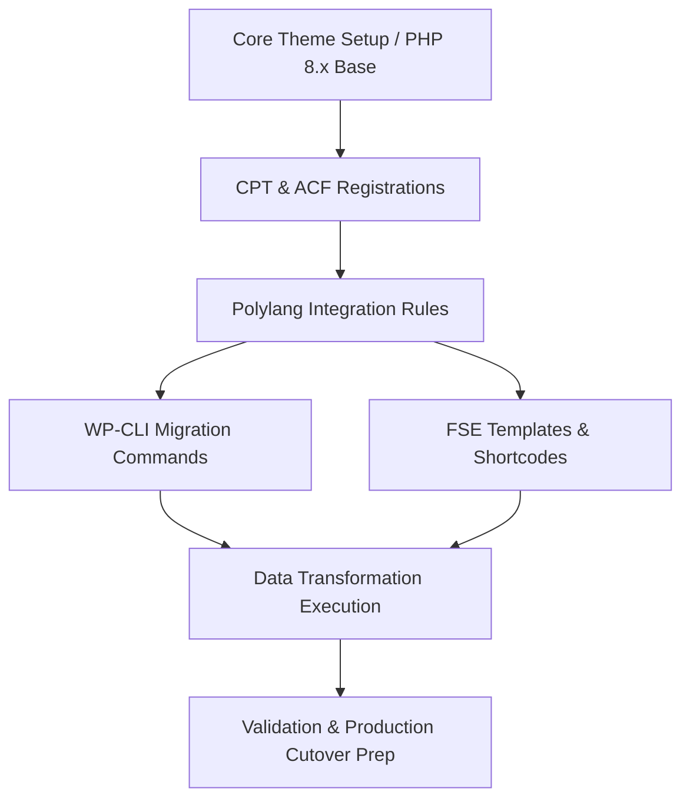

# CPT Migration Plan

## Context
**Goal:** Migrate legacy Alexandrinos Tachydromos and Board Members data into modern, block-native CPTs while adhering to PHP 8.x LTS standards.
**Environment:** Staging (`backstage.ekalexandria.org`)
**Source:** Parallel legacy database (`db207080_eka`)
**Target:** Current staging database

## Dependency Graph

## Vertical Task Slices

### Phase 1: Alexandrinos Tachydromos End-to-End
*This slice handles everything required for the newsletter, from registration to final data population.*
- **Scope:** Register the CPT and ACF field, prevent Polylang indexing, create the necessary FSE block templates, and build a WP-CLI command to migrate data from the legacy DB.
- **Verification:** The WP-CLI command runs idempotently, and legacy PDFs are accessible on the frontend via the new block templates.

### Phase 2: Board Members End-to-End
*This slice covers the extraction of the complex WPBakery grids into a clean, translatable CPT.*
- **Scope:** Register the CPT, explicitly expose it to Polylang for translation linking, and build the WP-CLI command to parse the legacy shortcode data into native posts.
- **Verification:** Board members appear in the admin panel with appropriate language associations, and the script does not duplicate entries on rerun.

## Estimated Token Cost Analysis

*Calculations based on standard AI-assisted coding rates (approx. $3/1M input, $15/1M output).*

| Phase / Action | Est. Input Tokens | Est. Output Tokens | Estimated Cost (USD) |
| :--- | :--- | :--- | :--- |
| **Phase 1: Implementation** | ~15,000 | ~2,500 | $0.08 |
| **Phase 2: Implementation** | ~12,000 | ~2,000 | $0.06 |
| **Testing, Debugging & Revisions** | ~20,000 | ~1,500 | $0.08 |
| **Total** | **~47,000** | **~6,000** | **~$0.22** |

### Recommendations for Efficiency
1. **DOM Parsing over Regex:** When extracting data from legacy WPBakery content in PHP, prefer using modern `DOMDocument` or reliable HTML parsing libraries over complex regex. This reduces edge-case bugs and debugging loops (saving tokens).
2. **Idempotency is Key:** The WP-CLI commands must check if a post exists before inserting. This allows us to re-run scripts repeatedly during testing without manually clearing the database, saving significant time and token overhead.
