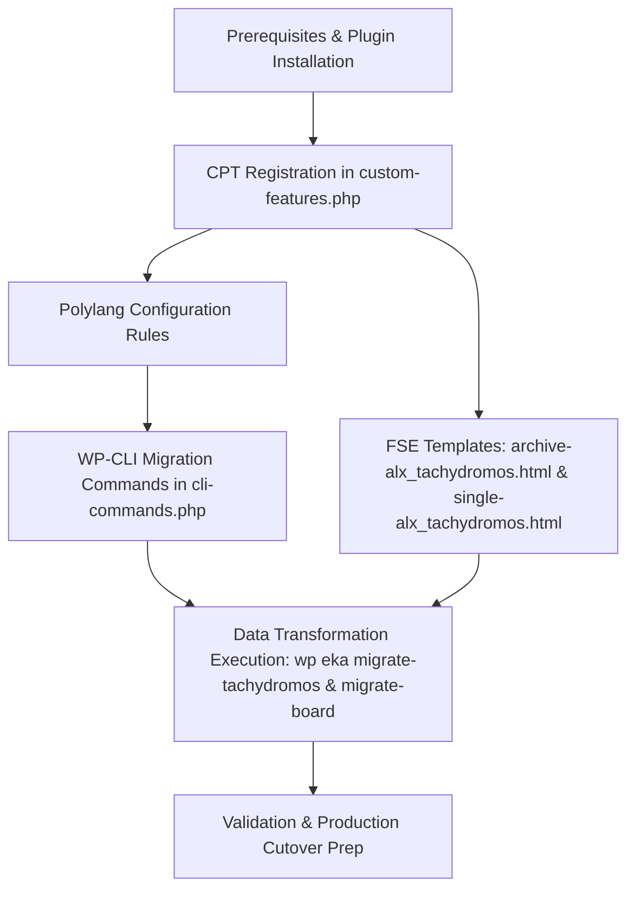

# CPT Migration Plan

## Context
**Goal:** Complete the migration of legacy "Alexandrinos Tachydromos" (Newsletters) and "Board of Directors" data from `db207080_eka` into clean, native Custom Post Types on the flagship theme.
**Environment:** Staging (`backstage.ekalexandria.org`)
**Source:** Parallel legacy database (`db207080_eka`)
**Target:** Current staging database

## Prerequisites
- **ImageMagick (PHP `imagick` extension)** must be installed and active.
- **Ghostscript** must be installed on the server to allow ImageMagick to process PDFs.
- **Plugins:** ACF (for PDF upload) and a **PDF Image Generator** plugin (to handle automatic PDF-to-thumbnail generation, as specified in the migration protocol).

## Dependency Graph

## Standards & Workflow (`/build` Loop)
To adhere to strict project standards, every task must follow the **`/build` workflow loop**:
1. **Implement:** Write the code to satisfy the acceptance criteria.
2. **Verify:** Run tests or execute scripts to confirm it works perfectly.
3. **Commit:** Create an atomic Git commit reflecting the exact slice of work.
4. **Check-off:** Mark the task complete in `todo.md`.

*Note: The user must approve ("yes" or "proceed") before finalizing a phase or running destructive commands.*

## Vertical Task Slices

### Phase 1: Environment & Plugin Preparation
*This slice handles the server-level and WordPress-level prerequisites before writing custom code.*
- **Scope:** Verify ImageMagick and Ghostscript. Install/activate ACF and a PDF Image Generator plugin.
- **Verification:** Plugins are active, server environment supports PDF rasterization.

### Phase 2: Alexandrinos Tachydromos (Newsletters) End-to-End
*This slice handles everything required for the newsletter, from registration to final data population.*
- **Scope:** Register the `alx_tachydromos` CPT (with Gutenberg enabled `show_in_rest => true`) with the Greek rewrite slug `αλεξανδρινός-ταχυδρόμος` and ACF field. Exclude it from Polylang indexing. Create the FSE block templates (`archive-alx_tachydromos.html`, `single-alx_tachydromos.html`).
- **Migration:** Build a WP-CLI command (`wp eka migrate-tachydromos`) to migrate data from the legacy DB with PDF upload date matching and image suffix stripping.
- **Verification:** Editor can create a post, upload a PDF, and the featured image is extracted automatically via the plugin. The WP-CLI command runs idempotently. Legacy PDFs are accessible on the frontend via the new block templates at the exact Greek URL.

### Phase 3: Board Members End-to-End
*This slice covers the extraction of the complex WPBakery grids into a clean, translatable `board_member` CPT.*
- **Scope:** Register the `board_member` CPT, explicitly expose it to Polylang for translation linking, and build the WP-CLI command (`wp eka migrate-board`) to parse the legacy shortcode data into native posts with Greek as the primary language and English/Arabic as translations. The script must parse the legacy layout order and assign a sequential `menu_order` for sorting, and set the post status to `publish` (allowing editors to disable them later by changing to draft).
- **Verification:** Board members appear in the admin panel with appropriate language associations, ordered correctly by `menu_order`, and with `publish` status. The script is idempotent and handles unlinked translations gracefully.

## Estimated Token Cost Analysis
*Calculations based on standard AI-assisted coding rates (approx. $3/1M input, $15/1M output).*

| Phase / Action | Est. Input Tokens | Est. Output Tokens | Estimated Cost (USD) |
| :--- | :--- | :--- | :--- |
| **Phase 1: Environment Prep** | ~5,000 | ~500 | $0.02 |
| **Phase 2: Tachydromos** | ~20,000 | ~3,500 | $0.11 |
| **Phase 3: Board Members** | ~15,000 | ~2,500 | $0.08 |
| **Testing, Debugging & Revisions** | ~25,000 | ~2,000 | $0.11 |
| **Total** | **~65,000** | **~8,500** | **~$0.32** |
