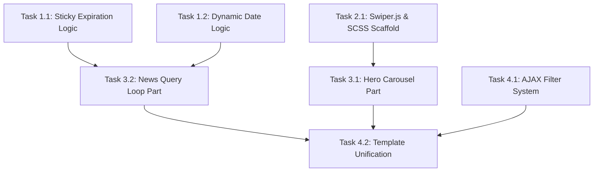

# Execution Plan: EKA Portal News Section Optimization (Task 5.3)

## Overview
This plan breaks down the modernization of the EKA Portal News Section into vertical, verifiable slices. We will prioritize native FSE block compatibility, performance, and clear boundaries between data logic and presentation.

## Dependency Graph

## Phase 1: Backend Foundations & Logic (PHP)
*Goal: Ensure data flows correctly to the FSE templates before building the UI.*

### Task 1.1: 30-Day Sticky Expiration & Announcement Pinning
- **Description:** Hook into `pre_get_posts` to apply sticky and "Announcements" pinning rules. This must expire automatically if the post is > 30 days old.
- **Implementation:** `inc/news-logic.php`
- **Acceptance Criteria:** 
  - Posts marked sticky or in "Announcements" published within the last 30 days appear first.
  - Older sticky/announcement posts behave as standard posts.
  - Works correctly within Polylang multilingual constraints.
- **Verification Step:** Create an "Announcements" post dated 31 days ago and one dated 29 days ago. Verify only the newer one sticks to the top.

### Task 1.2: Dynamic Date Formatting (21-Day Relative Date)
- **Description:** Filter the native `core/post-date` block output via PHP `render_block`.
- **Implementation:** `inc/news-logic.php`
- **Acceptance Criteria:**
  - Date <= 21 days: Displays as "X days ago"
  - Date > 21 days: Displays standard absolute date.
- **Verification Step:** Change publication dates of test posts and verify output on frontend.

---
**[CHECKPOINT 1] Human-in-the-Loop Verification Required:** Manually verify data querying logic and custom data formatting in isolation. Do not proceed until human approval is given.
**[GIT]** Commit phase: `git commit -m "feat(news): implement backend foundations and logic"`
---

## Phase 2: UI Foundations (Styles & Scripts)
*Goal: Prepare the static assets required by the FSE blocks.*

### Task 2.1: Swiper.js Integration & CSS Scaffolding
- **Description:** Enqueue Swiper.js. Set up the SCSS scaffolding for the carousel and the horizontal rows.
- **Implementation:** `functions.php`, `assets/scss/news.scss`, `assets/js/news-carousel.js`
- **Acceptance Criteria:** 
  - Scripts load without render-blocking.
  - Mobile-first CSS architecture for sleek rows.

---
**[CHECKPOINT 2] Human-in-the-Loop Verification Required:** Verify asset delivery and initial styles via browser inspection. Do not proceed until human approval is given.
**[GIT]** Commit phase: `git commit -m "feat(news): integrate Swiper.js and scaffold SCSS"`
---

## Phase 3: FSE Components
*Goal: Build the reusable template parts.*

### Task 3.1: News Hero Carousel Template Part
- **Description:** Construct the HTML template part for the 5-post hero carousel, wrapping a query loop in Swiper.js markup.
- **Implementation:** `parts/news-hero-carousel.html`
- **Acceptance Criteria:** 
  - Pulls the 5 most recent posts globally.
  - Operates independently from the main query.
- **Verification Step:** Check block editor and frontend for accurate 5-post carousel rendering.

### Task 3.2: News Query Loop Template Part
- **Description:** Create the native FSE Query Loop block structure for the sleek rows.
- **Implementation:** `parts/news-query-loop.html`
- **Acceptance Criteria:** 
  - Layout: Image, Title, Category, Excerpt, Dynamic Date, Share Button.
  - No Author displayed.
  - High SEO markup (semantic HTML).
- **Verification Step:** Inspect DOM for missing author, presence of all required fields, and semantic structure.

---
**[CHECKPOINT 3] Human-in-the-Loop Verification Required:** Verify complete FSE blocks in isolation via the Site Editor. Do not proceed until human approval is given.
**[GIT]** Commit phase: `git commit -m "feat(news): build hero carousel and query loop template parts"`
---

## Phase 4: Page Assembly & Filtering
*Goal: Put everything together and add AJAX interactivity.*

### Task 4.1: Filter System & AJAX Endpoint
- **Description:** Build the Category/Year/Month filter UI. Implement an AJAX-based History API system to refresh the main query loop.
- **Implementation:** `inc/news-filters.php`, `assets/js/news-filters.js`
- **Acceptance Criteria:** 
  - Filters update results without a hard page reload.
  - URL updates seamlessly (History API).
  - Sleek progress loader appears underneath the top bar during transitions.
  - Language boundaries are respected.
- **Verification Step:** Switch categories via the filter, ensure URL updates, content updates, and no full reload occurs. Switch language and verify results.

### Task 4.2: Template Unification
- **Description:** Apply the final layout (Carousel + Filters + Query Loop) to all target templates.
- **Implementation:** `templates/home.html` (or `index.html`), `templates/archive.html`, `templates/category.html`
- **Acceptance Criteria:** 
  - UI is 100% consistent across all news routes.
- **Verification Step:** Navigate between Home, an Archive, and a Category page to ensure visual parity. Run Lighthouse performance audit.

---
**[CHECKPOINT 4] Human-in-the-Loop Verification Required:** Final review, cross-device testing, and Lighthouse audit. Do not proceed until human approval is given.
**[GIT]** Commit phase: `git commit -m "feat(news): assemble pages and implement AJAX filtering"`
---

## Revised Cost Estimation & Aggressive Optimization

By selecting **Option B** (filtering the native `core/post-date` block) and enforcing strict human-in-the-loop checkpoints, we have eliminated the need for React component scaffolding and heavy JS generation. This drastically cuts output tokens.

| Metric | Revised Volume | Estimated Cost (Frontier Models) |
| :--- | :--- | :--- |
| **Input Tokens (Context, Reads)** | ~100k tokens | ~$0.30 (at $3.00 / 1M) |
| **Output Tokens (Code Generation)**| ~5k tokens | ~$0.075 (at $15.00 / 1M) |
| **Total Estimated AI Cost** | | **~$0.37** |

**Aggressive Token Optimization Strategies Enforced:**
1. **Eliminated Scaffold Code:** Option B removed the need to generate `block.json`, `index.js`, and React editor logic, cutting estimated output tokens by ~60%.
2. **Micro-Reading over Macro-Reading:** Instead of using `view_file` to read entire FSE templates or large PHP files, I will use `grep_search` to surgically locate and read only the necessary nodes. This prevents massive input context accumulation.
3. **Surgical Output Edits:** I will exclusively use `multi_replace_file_content` to inject logic rather than rewriting full `archive.html` or `functions.php` files.
4. **Concise Assistant Summaries:** Because human-in-the-loop requires multiple conversation turns, the chat history naturally grows. To prevent input token bloat, I will keep all conversational replies extremely concise and refrain from re-summarizing code or repeating the plan.
