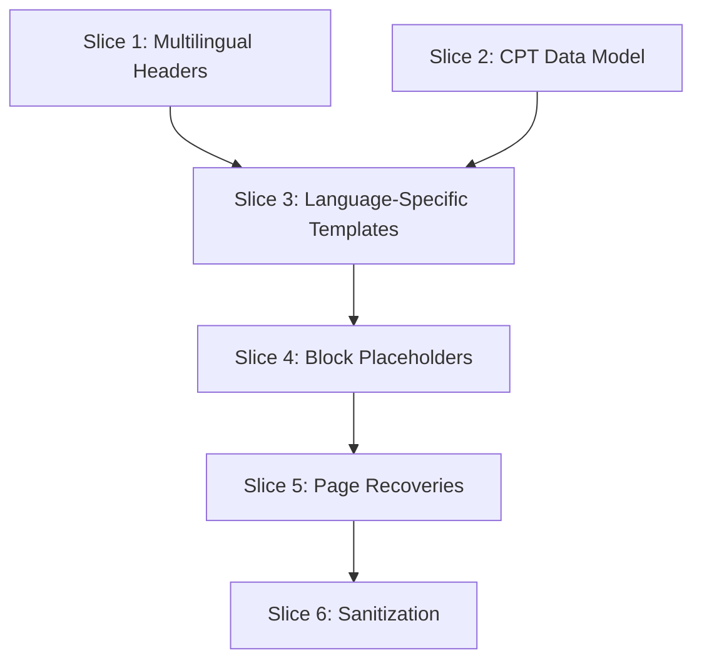

# Ekalexandria Phase 2: Modernization Plan

## Git Workflow Protocol
To maintain a healthy repository and isolate changes, every slice will strictly follow this workflow:
1. **Branching:** Create a new feature branch for each slice (e.g., `feature/slice-1-navigation`).
2. **Implementation:** Small, logical commits per task within the slice (e.g., `feat: build native top bar`).
3. **Verification:** Run local checks (linting, visual check) before finalizing the slice.
4. **Merge:** Merge the feature branch into `main` (or the primary working branch) at each Checkpoint.

## Token Optimization Protocol
To minimize LLM token usage and reduce costs:
1. **Targeted Context:** Do not re-read large files constantly. Rely on this `plan.md` and specific task files.
2. **Atomic Reads:** Use specific `view_file` calls with line numbers rather than reading entire directories.
3. **Sequential Execution:** Close out one task completely before opening files for the next.
4. **Pragmatic Implementation:** Prefer native Gutenberg blocks and straightforward HTML over complex programmatic React/PHP solutions whenever possible.

---

## Architectural Decisions (Aligned with Roadmap)

Based on the Project Roadmap and the goal to optimize LLM tokens and complexity, we have finalized the following approaches:

1. **Straightforward Placeholder Strategy:** To save tokens and avoid over-engineering, complex interactive elements (like Carousels and nested Sub-navigation menus) will **NOT** be custom-coded. We will insert standard, native Gutenberg blocks (e.g., `core/gallery`, `core/navigation`, `core/columns`) into the FSE templates as structural placeholders. The user will manually configure and populate the final content in the WP Admin.
2. **Language-Specific FSE Templates:** To dramatically simplify multilingual routing and avoid complex programmatic Polylang logic, we will build distinct FSE templates and template parts for each language:
   *   **Template Parts:** `header-el.html`, `header-en.html`, `header-ar.html` (and matching footers).
   *   **Templates:** `page-el.html`, `page-en.html`, `page-ar.html`.
   *   *Workflow:* The user will simply assign the correct language template to the respective page in the WordPress editor.

---

## Dependency Graph & Vertical Slices

### Slice 1: Global Elements & Multilingual Headers
**Branch:** `feature/slice-1-navigation`
*   **Tasks:**
    *   Create language-specific header parts (`header-el`, `header-en`, `header-ar`).
    *   Create language-specific footer parts (`footer-el`, `footer-en`, `footer-ar`).
    *   Add basic native Navigation block placeholders in the headers.

### Slice 2: Custom Post Types (Data Model)
**Branch:** `feature/slice-2-cpts`
*   **Tasks:**
    *   Register `neo_fos` CPT.
    *   Register Board Members CPT/Meta.
    *   Extract legacy data via CLI/Script.

### Slice 3: Language-Specific Core Templates
**Branch:** `feature/slice-3-templates`
*   **Tasks:**
    *   Build language-specific page templates (`page-el.html`, `page-en.html`, `page-ar.html`) that call their respective headers and footers.
    *   Build `single-neo_fos.html`, `archive-neo_fos.html`.
    *   Build `archive.html`, `search.html`, `404.html`.

### Slice 4: Placeholders for Interactive Blocks
**Branch:** `feature/slice-4-placeholders`
*   **Tasks:**
    *   Insert native Gutenberg placeholder blocks for the Homepage Carousel.
    *   Insert native Gutenberg placeholder blocks for the News Page Carousel.
    *   Insert placeholders for static image carousels across required templates.

### Slice 5: Homepage & Specific Page Recoveries
**Branch:** `feature/slice-5-page-recovery`
*   **Tasks:**
    *   Rebuild homepage widgets using native columns in `front-page.html`.
    *   Insert native Navigation placeholders for nested sub-menus (e.g., `/el/ίδρυση/`).
    *   Restore missing logos and icons on specific pages natively.

### Slice 6: Deployment & Sanitization Prep
**Branch:** `feature/slice-6-sanitization`
*   **Tasks:**
    *   Write WP-CLI cleanup script for legacy tables.
    *   Test cleanup locally.

---

## Estimated Token Cost & Analysis

By utilizing the "Placeholder Strategy" and "Language-Specific Templates", we significantly reduce the complexity and token output required for Slices 3, 4, and 5.

| Phase | Est. Input Tokens | Est. Output Tokens | Approx. Cost ($) |
| :--- | :--- | :--- | :--- |
| Slice 1 (Headers/Footers) | 15,000 | 1,500 | $0.07 |
| Slice 2 (CPTs) | 20,000 | 3,000 | $0.11 |
| Slice 3 (Language Templates) | 20,000 | 2,500 | $0.10 |
| Slice 4 (Placeholders) | 15,000 | 1,000 | $0.06 |
| Slice 5 (Page Recovery) | 20,000 | 2,000 | $0.09 |
| Slice 6 (Deployment) | 15,000 | 1,500 | $0.07 |
| **Total** | **105,000** | **11,500** | **~$0.50** |

*Note: Pricing assumes roughly $3.00 per 1M input tokens and $15.00 per 1M output tokens using industry-standard AI coding models. This optimized plan halves the original token estimate.*
